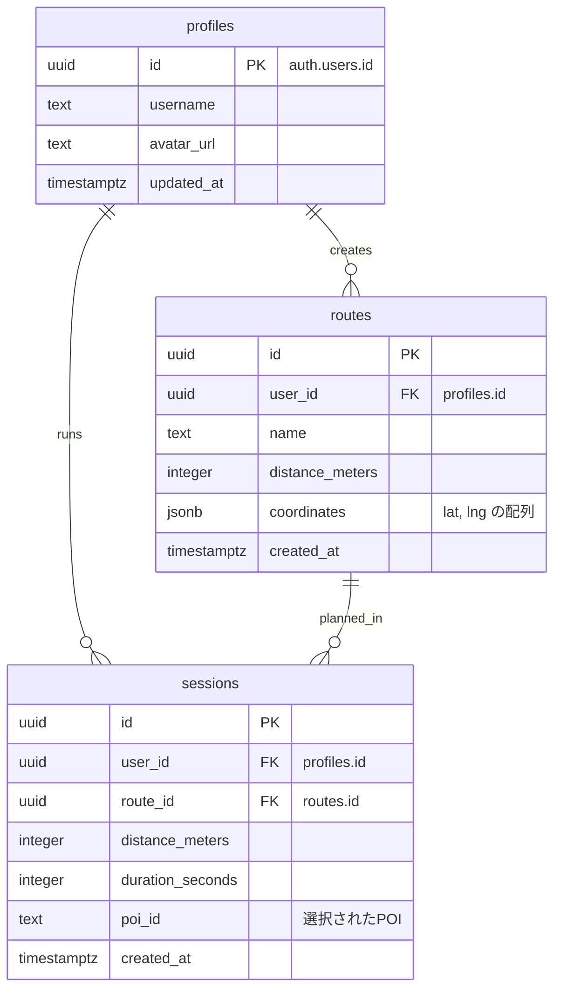

# データベース設計 (RUNdio)

## 1. ER図

## 2. テーブル定義

### profiles (ユーザープロフィール)
ユーザーの基本情報を管理します。Supabase Auth の `users` テーブルと紐付きます。

| カラム名 | 型 | 制約 | 説明 |
| :--- | :--- | :--- | :--- |
| id | uuid | PK, FK (auth.users) | ユーザーID |
| username | text | | ユーザー名 |
| avatar_url | text | | アバター画像URL |
| updated_at | timestamptz | DEFAULT now() | 更新日時 |

### routes (計画ルート)
ユーザーが作成または選択したルート情報を保存します。

| カラム名 | 型 | 制約 | 説明 |
| :--- | :--- | :--- | :--- |
| id | uuid | PK, DEFAULT gen_random_uuid() | ルートID |
| user_id | uuid | FK (profiles), NOT NULL | 作成者ID |
| name | text | NOT NULL | ルート名 |
| distance_meters | integer | NOT NULL | 総距離（メートル） |
| coordinates | jsonb | NOT NULL | 座標データの配列 |
| created_at | timestamptz | DEFAULT now() | 作成日時 |

### sessions (走行セッション)
実際の走行結果を記録します。

| カラム名 | 型 | 制約 | 説明 |
| :--- | :--- | :--- | :--- |
| id | uuid | PK, DEFAULT gen_random_uuid() | セッションID |
| user_id | uuid | FK (profiles), NOT NULL | 走行ユーザーID |
| route_id | uuid | FK (routes) | 使用したルートID |
| distance_meters | integer | NOT NULL | 走行距離（メートル） |
| duration_seconds | integer | NOT NULL | 走行時間（秒） |
| poi_id | text | | 立ち寄ったPOIのID |
| created_at | timestamptz | DEFAULT now() | 走行日時 |

## 3. RLS (Row Level Security) ポリシー
セキュリティを担保するため、以下のポリシーを適用しています。

- **profiles**: 自分のプロフィールのみ閲覧・更新可能。
- **routes**: 自分が作成したルートのみ閲覧・追加可能。
- **sessions**: 自分の走行履歴のみ閲覧・追加可能。
