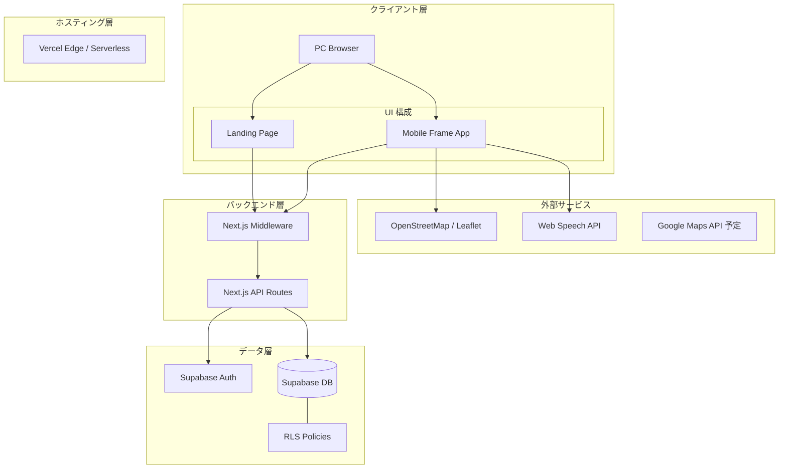
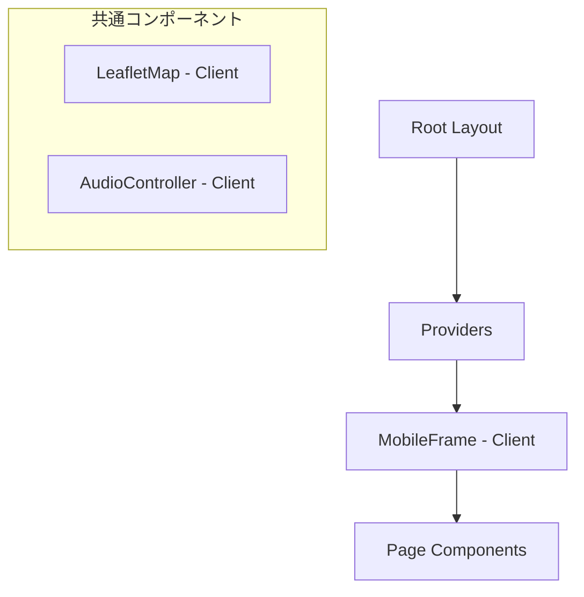

# システムアーキテクチャ設計 (RUNdio)

## 1. 技術スタック
本プロジェクトは、デモデイおよび将来の本番運用を見据え、以下のモダンな技術スタックを採用しています。

| レイヤー | 技術 | 選定理由 |
| :--- | :--- | :--- |
| **フロントエンド** | Next.js 15 (App Router) | 高速なレンダリング、SEO対応、開発効率の高さ。 |
| **言語** | TypeScript | 型安全性の確保によるバグの抑制と保守性の向上。 |
| **スタイリング** | Tailwind CSS | 迅速なUI構築とデザインの一貫性維持。 |
| **バックエンド** | Next.js API Routes | フロントエンドと同一リポジトリでの効率的なAPI開発。 |
| **データベース** | Supabase (PostgreSQL) | RLSによるセキュリティ、リアルタイム性、運用の容易さ。 |
| **認証** | Supabase Auth (SSR) | セッション管理の容易さとSupabase DBとの親和性。 |
| **ホスティング** | Vercel | Next.jsとの最高レベルの親和性と自動デプロイ。 |

## 2. アーキテクチャ概要図

## 3. コンポーネント設計
Next.js の Server Components と Client Components を適切に使い分け、パフォーマンスとインタラクティブ性を両立させています。

### 階層構造

### 主要コンポーネントの方針
- **MobileFrame**: PCブラウザ上でスマホアプリの体験を模倣するための外枠。パスに応じてLP表示とアプリ表示を切り替えます。
- **LeafletMap**: クライアントサイドでのみレンダリングされる動的地図コンポーネント。
- **WebSpeechQueue**: 音声通知を管理するキューシステム。
