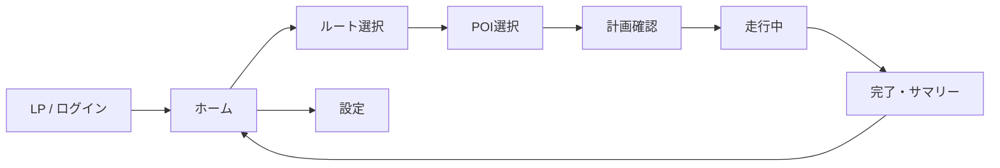

# UI/UX 設計書 (RUNdio)

## 1. デザインコンセプト
- **伴走・安心・ワクワク**: ランニング中の孤独感を解消し、ラジオのような親しみやすさを提供。
- **モバイルファースト**: PCブラウザデモでも、常にスマートフォンアプリとしての体験を重視。
- **ダークモード対応**: 夜間や屋外での視認性を考慮したカラー設計。

## 2. カラーパレット
| 用途 | カラーコード | 説明 |
| :--- | :--- | :--- |
| **Primary** | `#0F172A` | 深いネイビー。信頼感と夜間の視認性。 |
| **Accent** | `#F97316` | エナジー系オレンジ。活力とワクワク感。 |
| **Success** | `#14B8A6` | ティール。達成感と進捗。 |
| **Background** | `#F8FAFC` | オフホワイト。清潔感と読みやすさ。 |

## 3. 画面一覧と画面遷移図

## 4. 主要画面の設計

### LP (Landing Page)
- **目的**: サービス価値の訴求とユーザー登録。
- **UI要素**:
  - ヒーロービジュアル（スマホモックアップ）
  - 機能紹介（ラジオ体験、ルート検索）
  - 認証フォーム（サインアップ / ログイン）

### 走行中 (RunActive)
- **目的**: 走行データのリアルタイム表示と音声ガイド。
- **UI要素**:
  - 経過時間（大きく表示）
  - 距離、ペース（サブ表示）
  - 次のチェックポイント情報
  - 音声ON/OFF、一時停止、終了ボタン

### 完了・サマリー (RunComplete)
- **目的**: 達成感の醸成と次回の提案。
- **UI要素**:
  - トロフィーアイコン
  - 走行統計（距離、時間、平均ペース）
  - AIによる次回提案メッセージ
  - シェアボタン、ホームへ戻るボタン
