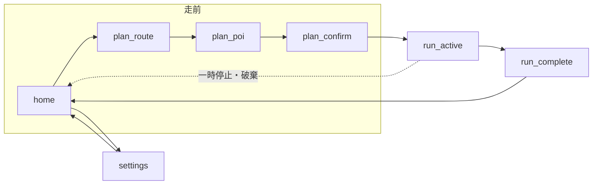
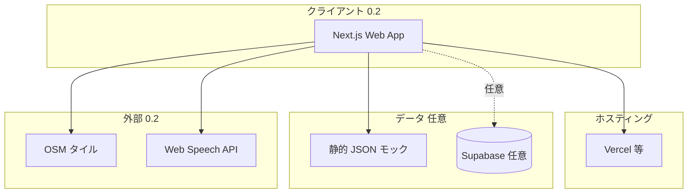
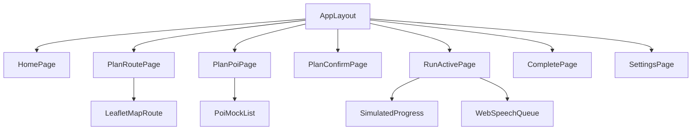

# 詳細要件定義書

**プロダクト**: RUNdio（ランディオ）— **英語表記 RUNdio**、**日本語 ランディオ**  
**キャッチコピー**: ラン×レディオ：あなただけのランニング用ラジオ  
**文書版数**: 0.2（Web デモ・低コスト提出向け）  
**作成根拠**: `docs/output/system_requirements.md`（版 0.2）、`docs/input/*`、`docs/AGENT_HANDOFF.md`  
**テンプレート**: `docs/template/Requirements_Specification_Template.md` に準拠  
**仮定**: 未確定事項は `(仮定)` または `[仮]` と明記する。

**0.2 の要点**: 主クライアントを **PC ブラウザ上の Web アプリ**とする。地図は **Leaflet + OSM タイル**（ライセンス・帰属遵守）、POI は **JSON モック**既定。走行中は **疑似進行**（タイマー／プログレス等）。音声は **Web Speech API 等**を優先。Google Maps／有料 TTS はデモスコープから外す。

---

## 1. プロジェクト概要

### 1.1 プロジェクト名

- **RUNdio（ランディオ）Web デモ MVP（提出・学習用）**（ワーキングタイトル）。モバイル本番はロードマップ上で別フェーズとして扱う。

### 1.2 背景・目的

- **背景**: ソロランナーは練習内容のマンネリ、モチベーション低下、走行中の単調さを抱えやすい。既存の記録アプリやラジオ単体では、「今日の一本の計画」「伴走する音声」「走後の次の一歩」が一体になった体験が得にくい。  
- **目的**: 上記課題を、**ルート上条件検索によるプランニング**、**パーソナルラジオ型の走行中音声**、**走後サマリーと次回提案**の組み合わせで緩和する。定量目標（KPI 数値）は確定後に本書を更新する `(仮定)`。

### 1.3 システムのビジョン / スコープ

- **ビジョン**: 「走る前から走ったあとまで、**ラン×レディオ——あなただけのランニング用ラジオ**が、今日の一本を組み立て、走りながら伴走し、あと振り返りまで続ける」体験を標準にする。  
- **スコープ（含む）**: スマホ向けクライアントにおける走前計画、走行中トラッキングと音声、走後表示、基本設定。地図／施設検索による **MVP は少なくとも 1 施設カテゴリ**（例：入浴施設）`(仮定)`。  
- **スコープ（含まない）**: 食べログ等を用いた飲食店紹介、Garmin 等特定デバイス必須機能、ソーシャル・チームラン（MVP）、Google Fit の本実装（**拡張フックのみ可**）。

> **版 0.2 の MVP** は **Web アプリ**（Next.js 等）を主戦場とする。`demo-implementation/` を拡張するか同一パターンで新規ルートを切るかは実装時に決める。モバイルアプリ（React Native / ネイティブ）は**実機走行が課題必須**となった場合の拡張候補 `(仮定)`。

---

## 2. ビジネス要件

### 2.1 ビジネスモデル情報（任意）

| リーンキャンバス要約 | 内容 |
|----------------------|------|
| 課題 | 一人ランのマンネリ、モチベーション、走行中の楽しさ不足 |
| 価値提案 | 計画・音声・走後が一体の「パーソナルラジオ」体験 |
| 顧客 | 週数回ソロランするスマホユーザー `(仮定)` |
| チャネル | **提出デモ**: PC ブラウザ（本書 0.2）。将来: App Store / Google Play 等 `[仮]` |
| 収益 | 未確定（サブスク／フリーミアム等を想定しうる）`[仮]` |

- **7 Powers 視点（たたき台）**: 差別化は**体験設計の一体性**と**音声品質への投資**。規模の経済・ネットワーク効果は Phase 2 以降で検討 `[仮]`。  
- **市場規模 / 成長予測**: 本ドラフトでは**具体的数値を記載しない**（ハルシネーション回避）。要調査 `[仮]`。

### 2.2 成果指標（KPI/KGI）

| 指標 | 目標 | 備考 |
|------|------|------|
| MAU / 継続率 | 未定 | リリース前に設定 `[仮]` |
| セッション完了率 | ベースライン比改善 | アプリ内計測 `(仮定)` |
| 音声 NPS / 主観満足 | 定性＋簡易スコア | プロトタイプで検証 |

### 2.3 ビジネス上の制約

- **0.2** は従量課金 API を使わない方針。将来フェーズで地図・施設・TTS の**コスト上限**を設定 `[仮]`。  
- **個人情報保護法**および位置・健康関連データのガイドラインに沿った同意・保存期間の設計。  
- 開発リソース・リリース期限はプロジェクト計画に依存 `(仮定)`。

---

## 3. ユーザー要件

### 3.1 ユーザープロファイル / ペルソナ

- **主ペルソナ（要約）**: 30 代前後の会社員 `(仮)`。週数回、**一人で**ラン。スマホ＋イヤホン利用。Garmin 等は任意。走前に「今日の一本」を決めたい。走行中は**数値＋励まし**の音声が欲しい。走後は**次を考えてほしい**。  
- **課題**: マンネリ、一人だとテンションが上がらない、記録だけでは飽きる。

### 3.2 ユーザーストーリー

1. **ランナーとして**、今日のルートの**前方**に**入浴施設**を組み込みたい。**なぜなら**ゴール後のご褒美で走る動機が上がるからだ。  
2. **ランナーとして**、走っている間に**ラジオのように**自然な音声で**ペースと励まし**を受け取りたい。**なぜなら**単調さを減らしたいからだ。  
3. **ランナーとして**、**距離**と**時間**のどちらか好きな方で**区切り通知**を選びたい。**なぜなら**練習スタイルが人によって違うからだ。  
4. **ランナーとして**、走り終わったあと**次のセッション**で何をすべきか**短く提案**してほしい。**なぜなら**考える負担を減らしたいからだ。  
5. **ランナーとして**、ラジオアプリを聴きながらでも**音声ガイドが被せて**聞き取れるようにしたい。**なぜなら**普段の習慣を壊したくないからだ。

### 3.3 MVP（Minimum Viable Product）の定義

- **MVP で実装する範囲（0.2）**: `docs/input/mvp-scope.md` の「MVP に含める」に**概念的に**相当するが、実装は **Web 上で次のように読み替える**:
  - ルート: **プリセットまたは地図上の単純定義**（デモ用座標・Polyline）で可。  
  - 条件検索: **モック JSON** から候補を列挙（ルート上距離はデモ用の算出で可）。  
  - 走行中: **疑似セッション**（経過時間＋仮想距離進行。実 GPS 不要）。  
  - 音声: **Web Speech API** または短いダミー音声、区切り・番組構成（粗）は同様。  
  - 他オーディオ: **ブラウザ範囲の注意 UI** に置き換え可（下記 F-007）。  
  - 走後・設定: サマリー、ルールベース次回提案、区切り基準の切替。  
- **MVP のゴール**: **10 分発表向け**に、プロダクトの流れ（計画→伴走→振り返り）を**クリックで辿れる**こと。価値仮説の検証はデモ後のフィードバックでも可 `[仮]`。

---

## 4. 機能要件

### 4.1 機能一覧 / MoSCoW 分類

| 機能 ID | 機能名 | 要約 | Must/Should/Could/Won't | MVP 対象 |
| ------- | ------ | ---- | ----------------------- | -------- |
| F-001 | ランセッション制御 | 開始・一時停止・終了。**0.2**: 疑似進行＋経過時間（実 GPS は不要） | Must | Yes |
| F-002 | ルート作成・選択 | 当日のルートを定義 | Must | Yes |
| F-003 | ルート上条件検索 | 前方距離基準で施設候補を列挙・選択 | Must | Yes |
| F-004 | チェックポイント音声 | 接近時にご褒美メッセージ等を再生 | Must | Yes |
| F-005 | 走行中音声エンジン | 数値・励まし・オープニング／中盤／終盤 | Must | Yes |
| F-006 | 区切り基準設定 | 距離 or 時間の選択、粒度 | Must | Yes |
| F-007 | 他オーディオ共存 | **0.2**: 別タブ再生との併用注意・音量ガイド等（モバイル同等ダッキングは不要求） | Must | Yes（簡略化） |
| F-008 | 走後サマリー | 距離・時間・平均ペース等 | Must | Yes |
| F-009 | 次回セッション提案 | ルールベース提案 | Must | Yes |
| F-010 | 話量モード | 黙々／標準／よしよし多め | Should | No |
| F-011 | 手動ピン留めスポット | 地図上の任意点 | Could | No |
| F-012 | Google Fit 連携 | 読み書き | Could | No（フックのみ可） |
| F-013 | アカウント登録・ログイン | メール／SNS 等 | Should | [仮] |
| F-014 | 食べログ系飲食紹介 | 外部レビュー依存 | Won't | No |

### 4.2 機能詳細仕様

#### 4.2.1 `<機能 ID: F-003 ルート上条件検索（チェックポイント選定）>`

- **概要**: ユーザーが定義した**ルート上**で、指定した**前方距離**（例：ゴール手前 10 km 相当のルート上地点周辺）を基準に、**施設カテゴリ**（MVP は 1 種、例：`public_bath` / 入浴施設 `(仮定)`）で候補を検索し、1 件以上を**チェックポイント**としてセッションに紐づける。  
- **ユースケース**: 「走前計画時に、今日のゴール付近で銭湯に立ち寄る前提を決める」  
- **前提条件**: ルートが地図上で有効であること（デモはローカル／静的データでも可）。**0.2** は外部 Places API を呼ばず **モック JSON** でよい。  
- **正常系フロー**:
  1. ユーザーがルート作成・選択を完了する。  
  2. 「チェックポイント追加」を選び、カテゴリ（MVP 固定または選択肢 1 つ）を指定する。  
  3. システムがルート上の基準点（例：終点からのルート上距離で算出）周辺を検索する。  
  4. 候補リストを距離順等で表示し、ユーザーが 1 件を確定する。  
  5. 確定した施設に**デフォルトまたは編集可能なショートメッセージ**（ご褒美一言）を紐づける `[仮]`。  
- **例外系フロー**:
  - 候補 0 件 → メッセージ表示し、検索半径拡大またはカテゴリ変更を提案 `(仮定)`。  
  - API 失敗 → リトライ、オフライン時は保存待ちまたは手動ピン（Phase 2）を案内 `[仮]`。  
- **UI 要件**: 地図上でルートと候補ピンが識別できる。一覧はスクロール可能で、主要情報（名称、ルート上からの距離）を表示。  
- **非機能面注意**: **0.2** は静的データのためレート制限は原則なし。将来 API 化時は 3 秒以内を目安 `(仮定)`。

#### 4.2.2 `<機能 ID: F-005 走行中音声エンジン>`

- **概要**: セッション中、**区切りイベント**（距離または時間）と**セグメント**（オープニング／中盤／終盤）に応じて、**TTS またはプリレンダ音声**でペース・経過・励ましを読み上げる。チェックポイント接近で **F-004** を挿入。  
- **ユースケース**: 「イヤホンで走りながら、ラジオのように伴走音声を聞く」  
- **前提条件**: ブラウザが音声出力を許可している（ユーザー操作後の `SpeechSynthesis` 等）。**0.2** は位置情報を必須としない。  
- **正常系フロー**:
  1. セッション開始で**オープニング**（短文）を再生。  
  2. ユーザー設定の区切り（例：1 km ごと、または 5 分ごと）で**数値＋励まし**を生成・再生。  
  3. 残り距離または時間がしきい値を下回ったら**終盤トーク**。  
  4. チェックポイントのジオフェンス（またはルート上距離）で **F-004** を挿入。  
- **例外系フロー**:
  - TTS 失敗 → テキスト通知またはビープにフォールバック `[仮]`。  
  - 他タブ・他アプリが音声を占有 → **0.2** はユーザーに音量・一時停止の案内を表示（モバイルダッキングは対象外）`(仮定)`。  
- **UI 要件**: 走行画面は**一時停止・終了・現在ペース**を大きく表示。音声設定へのショートカット。  
- **非機能面注意**: **自然な人間的話し言葉**を品質目標とし、1 発言は短文（目安 10〜20 秒以内）`(仮定)`。

#### 4.2.3 `<機能 ID: F-008 / F-009 走後サマリーと次回提案>`

- **概要**: セッション終了後、**距離・時間・平均ペース**（取得可能なら最大心拍等）を表示し、**ルールベース**で次回の提案文を表示する（例：前回比ペースが上がりすぎ → リカバリーを提案）`(仮定)`。  
- **ユースケース**: 「走った直後に達成感を得て、次の練習の方向性を知る」  
- **前提条件**: セッションが正常終了している、またはユーザーが「破棄」を選んでいない。  
- **正常系フロー**:
  1. サマリー画面を表示。  
  2. ルールエンジンが提案カテゴリを決定し、短文を表示（必要なら読み上げオプション `[仮]`）。  
  3. 「ホームへ」「同じプランでもう一度」等の CTA `(仮定)`。  
- **例外系フロー**:
  - セッションデータ不足（例: 即終了）→ 推定値表示と注意書き。  
- **UI 要件**: 数字は大きく、提案は 1〜2 文に限定。  
- **非機能面注意**: 個人データの画面キャプチャ想定に配慮（任意でプライバシーマスク）`[仮]`。

---

## 5. 非機能要件

### 5.1 パフォーマンス要件

- **レスポンス時間**: 走行中の画面操作（一時停止・終了）は**体感 1 秒以内**を目安 `(仮定)`。走前の検索は**3 秒以内**（通信依存）を目安。  
- **同時接続数**: 初期は**同時アクティブ数千未満**を想定し、バックエンドを設計 `(仮定)`。  
- **処理量**: **0.2** はクライアント内の疑似進行が主で、位置ポイントのサーバ送信は任意。モバイル本番では送信頻度をパラメータ化 `[仮]`。

### 5.2 セキュリティ要件

- **認証／認可**: MVP でログインを入れる場合は **Clerk または Supabase Auth** `(仮定)`。ローカルのみ MVP もありうる。  
- **データ保護**: 全通信 **TLS 1.2+**。保存時は端末内暗号化または DB 暗号化を検討 `[仮]`。  
- **監査ログ**: 管理用 API がある場合は認証失敗・設定変更を記録 `(仮定)`。  
- **コンプライアンス**: 日本の個人情報保護法。利用者が**位置・健康データの利用目的**を理解できる UI。

### 5.3 可用性・信頼性

- **稼働率**: バックエンド利用時はクラウド SLA に準拠（例：99.5% 以上を目安）`(仮定)`。  
- **障害時**: オフライン時は**端末内にセッションを保持**し、復帰後に同期可能な設計を検討 `[仮]`。  
- **フェイルオーバー**: マネージド DB のマルチ AZ 等を利用可能 `(仮定)`。

### 5.4 ユーザビリティ / UI・UX

- **アクセシビリティ**: タップ領域 44pt 以上目安、コントラスト比 WCAG 2.1 AA を目指す `(仮定)`。  
- **多言語**: MVP は**日本語**。英語は Phase 2 `[仮]`。  
- **操作導線**: 走前の「計画完了まで」のタップ数を**最小化**（目安 6 タップ以内、要検証）`(仮定)`。

#### 5.4.1 デザインコンセプト（詳細）

- **キーワード**: 伴走、ラジオ、ワクワク、安心、ワンタップ。  
- **カラーパレット（案）** `(仮定)`:
  - メイン: 深いネイビー `#0F172A`（夜間・屋外視認性）  
  - アクセント: エナジー系オレンジ `#F97316`  
  - 背景: オフホワイト `#F8FAFC` / ダークモード時は `#020617`  
  - 成功・進捗: ティール `#14B8A6`  
- **タイポグラフィ（案）**: 日本語は **Noto Sans JP**、英数字は **Inter**（ライセンス要確認）`(仮定)`。

#### 5.4.2 画面一覧

| No | 画面 ID | 画面名 | 主な目的 |
|----|---------|--------|----------|
| S-01 | home | ホーム | 今日のラン開始、履歴入口 |
| S-02 | plan_route | ルート計画 | ルート作成・選択 |
| S-03 | plan_poi | チェックポイント | 条件検索・候補選択 |
| S-04 | plan_confirm | 計画確認 | 距離・目標・メッセージ確認 |
| S-05 | run_active | 走行中 | 主要指標、一時停止・終了 |
| S-06 | run_complete | 完了 | サマリー・次回提案 |
| S-07 | settings | 設定 | 区切り、音声、連携フック |

#### 5.4.3 画面遷移図（Mermaid）



#### 5.4.4 ワイヤーフレーム（テキスト）

**S-05 走行中**

```
┌─────────────────────────────┐
│  ◀ ホーム        [一時停止]  │
│                             │
│      ┌─────────────────┐    │
│      │  00:42:18       │ 経過時間
│      │  8.2 km         │ 距離
│      │  5'10"/km       │ 現在ペース
│      └─────────────────┘    │
│                             │
│  ▶ 音声: オン   [設定]      │
│                             │
│  ┌─────────────────────────┐│
│  │    [ 終了して完了へ ]    ││
│  └─────────────────────────┘│
└─────────────────────────────┘
```

**S-03 チェックポイント（条件検索）**

```
┌─────────────────────────────┐
│  ◀ 戻る      チェックポイント │
│  [ 地図: ルート + 候補ピン ]  │
│                             │
│  カテゴリ: [ 入浴施設 ▼ ]    │
│  候補一覧                    │
│  ├ 〇〇湯  ルートから 0.3km  │
│  ├ △△スパ ルートから 0.8km  │
│  └ ...                       │
│  [ この施設に決定 ]          │
└─────────────────────────────┘
```

**S-06 完了**

```
┌─────────────────────────────┐
│        おつかれさまでした     │
│  10.1 km   58:20   5'46"/km  │
│                             │
│  次の提案                    │
│  「明日は短めのリカバリーが   │
│   おすすめです」             │
│  [ ホーム ] [ 詳細 ]         │
└─────────────────────────────┘
```

### 5.5 スケーラビリティ

- **水平スケーリング**: BFF / API はステートレス。Supabase / Serverless でオートスケール `(仮定)`。  
- **キャッシュ**: 施設検索結果を**短 TTL** でキャッシュし API コストを抑制 `[仮]`。

---

## 6. インテグレーション要件

### 6.1 外部サービス / SaaS 連携

| 区分 | 候補（0.2 既定） | 用途 |
|------|------------------|------|
| 地図表示 | **Leaflet** + **OSM タイル**（利用条件・帰属表示遵守） | ルート・候補ピン表示 |
| 施設・ルート補助 | **リポジトリ同梱 JSON**（モック POI） | 条件検索のデモ |
| 認証 | **なし**または Clerk / Supabase Auth `[仮]` | デモは未ログイン可 |
| DB | **なし**または Supabase (PostgreSQL) `[仮]` | 永続化が不要なら省略可 |
| 読み上げ | **Web Speech API**、短い **HTMLAudio** クリップ | 走行中トーク |
| ホスティング | Vercel 等 | Web デモ配信 |
| （将来） | Google Maps、クラウド TTS | 本番品質・実走向け `[仮]` |

### 6.2 API 仕様（論理 REST / BFF 例）

**0.2** はクライアントが **静的 JSON** を読むだけで完結してよい。将来、有料地図を使う場合は **キー隠蔽**のため BFF 経由を推奨 `(仮定)`。

#### `POST /api/v1/plan/search-poi`

- **概要**: ルートジオメトリとカテゴリを渡し、ルート近傍の候補を返す。  
- **Request** (JSON):

```json
{
  "routePolyline": "encoded_polyline_string",
  "category": "public_bath",
  "anchor": "route_end",
  "alongRouteDistanceMeters": 10000,
  "searchRadiusMeters": 500
}
```

- **Response** (200):

```json
{
  "candidates": [
    {
      "placeId": "mock-onsen-001",
      "name": "〇〇湯",
      "distanceAlongRouteMeters": 9950,
      "detourMeters": 120
    }
  ]
}
```

- **Errors**: `400` バリデーション、`502` 上流 API 失敗。

#### `POST /api/v1/sessions`

- **概要**: セッション開始メタデータの登録（ログイン時）`(仮定)`。  
- **Request**:

```json
{
  "plannedRouteId": "uuid",
  "checkpointPlaceId": "mock-onsen-001",
  "splitBasis": "distance",
  "splitIntervalMeters": 1000
}
```

- **Response**: `{ "sessionId": "uuid", "startedAt": "ISO8601" }`

#### `PATCH /api/v1/sessions/{id}/complete`

- **概要**: 終了時に集計結果を送信。  
- **Request**: `{ "endedAt": "ISO8601", "distanceMeters": 10120, "durationSeconds": 3500 }`  
- **Response**: `{ "nextSuggestion": "recovery_easy" }`

### 6.3 データ連携要件

- **形式**: JSON、UTF-8。  
- **頻度**: セッション中はバッチまたはストリーム（位置は端末で集約し間欠送信）`(仮定)`。  
- **再送**: 指数バックオフで最大 N 回 `[仮]`。

---

## 7. 技術選定とアーキテクチャ

### 7.1 技術スタックの要約

| 層 | 技術 | 備考 |
|----|------|------|
| **Web（0.2 主）** | Next.js（App Router）、TypeScript、Tailwind CSS `(仮定)` | 計画〜完了の一連 UI |
| 地図 | Leaflet / react-leaflet、OSM タイル | タイル URL・帰属を README に記載 |
| BFF / API | **任意**。モックのみなら Route Handler 不要可 | |
| DB | **任意**。デモのみなら省略可 | |
| 認証 | **任意** | |
| デプロイ | Vercel（Web） | |
| モバイル（将来） | React Native (Expo) または Swift/Kotlin `[仮]` | 実走・バックグラウンド |

### 7.2 アーキテクチャ概要

- **クライアント層（0.2）**: **Web アプリ**（計画・疑似走行・音声・静的データ読込）  
- **API 層**: **省略可**。必要時のみ BFF（将来のキー隠蔽・永続化）  
- **データ層**: **省略可**、または PostgreSQL（提出物が DB 必須の場合）  
- **外部（0.2）**: OSM タイル（無償枠・利用条件遵守）、ブラウザ標準 API。**Places／有料 TTS は使わない**

### 7.3 システム構成図（Mermaid）



### 7.4 コンポーネント階層図（Web デモ想定・Mermaid）



- **主要コンポーネント方針（0.2）**:
  - **`WebSpeechQueue`**: `speechSynthesis` または短い `<audio>` のキュー。状態: `idle` / `playing`。  
  - **`SimulatedProgress`**: 経過秒数と仮想ペースから距離を更新し、区切り・チェックポイント接近を発火。  
  - **`PoiMockList`**: 静的 JSON をフィルタし、地図ピンと一覧を同期。BFF 不要。  
  - モバイル本番時は従来の `AudioController` / GPS サブスクライブに置き換えうる `(仮定)`。

### 7.5 データベース設計

#### ER 図（Mermaid）

```mermaid
erDiagram
  USER ||--o{ ROUTE : creates
  USER ||--o{ SESSION : runs
  USER ||--o{ USER_SETTINGS : has
  ROUTE ||--o{ SESSION : planned_in
  ROUTE {
    uuid id PK
    uuid user_id FK
    text encoded_polyline
    int distance_meters
    timestamptz created_at
  }
  SESSION {
    uuid id PK
    uuid user_id FK
    uuid route_id FK
    text checkpoint_place_id
    text split_basis
    int split_interval
    timestamptz started_at
    timestamptz ended_at
    int distance_meters
    int duration_seconds
    text next_suggestion_key
  }
  USER_SETTINGS {
    uuid user_id PK_FK
    text split_basis
    int split_interval_meters
    int split_interval_seconds
    text voice_profile
  }
  USER {
    uuid id PK
    text email
    timestamptz created_at
  }
```

#### 主要テーブル定義（要約）

| テーブル | カラム（例） | 型 | 制約 |
|----------|--------------|-----|------|
| users | id | uuid | PK, default gen_random_uuid() |
| routes | encoded_polyline, distance_meters | text, int | NOT NULL |
| sessions | split_basis | text | `distance` \| `time` |
| user_settings | split_interval_meters | int | CHECK > 0 |

`(仮定)` MVP で匿名利用の場合は `user_id` を端末 UUID に置き換える案あり。

---

## 8. 開発プロセス / スケジュール

### 8.1 開発モデル・プロセス

- **アジャイル／2 週スプリント**を想定。MVP は機能フラグでリリース範囲を制御 `(仮定)`。

### 8.2 スケジュール例

| フェーズ | 期間 | 主なタスク |
| -------- | ---- | ---------- |
| 要件定義 | [TBD] | 本書 0.2 レビュー、課題必須スタックの確認 |
| デザイン | [TBD] | デモ用ワイヤー固定、発表パス用シードデータ |
| 実装 MVP | [TBD] | Next.js: 地図、モック POI、疑似ラン、音声、完了 |
| テスト | [TBD] | 主要ブラウザでのクリック通し、音声の手動確認 |
| リリース＆検証 | [TBD] | デプロイ URL（必要時）、スライド用キャプチャ |

---

## 9. リスクと課題

### 9.1 リスク一覧

| No | リスク内容 | 影響度 | 発生確率 | 対応策 |
| --- | ---------- | ------ | -------- | ------ |
| R1 | **0.2**: ブラウザごとの Speech API 差・自動再生制限 | 中 | 中 | ユーザー操作後に再生、フォールバック文言表示 |
| R2 | **0.2**: OSM タイルの利用ポリシー違反・過負荷 | 低 | 低 | 正しい帰属表示、タイル CDN の利用条件確認、キャッシュ方針 |
| R6 | 将来: OS のバックグラウンド位置・音声制限 | 高 | 中 | ネイティブ化時に再評価 |
| R7 | 将来: Maps/TTS のコスト超過 | 中 | 中 | キャッシュ、上限アラート |
| R3 | 音声品質が期待を下回る | 高 | 中 | 短文、ハイブリッド収録、ユーザーテスト |
| R4 | ルート上距離と POI の不一致 | 中 | 中 | バッファ、現地テスト |
| R5 | 開発リソース不足 | 中 | 中 | スコープ固定（mvp-scope） |

### 9.2 課題 / 前提条件

- **0.2** は **Web＋モック**で固定。課題が **Expo 実機必須**の場合は別途スコープ変更。  
- **ログインなし**でデモするかは課題要件に従う（0.2 推奨: なし）。  
- 将来、有料地図を使う場合は**契約・キー管理**が必須。

---

## 11. ランニング費用と運用方針

### 11.1 ランニング費用の目安

| 項目 | 目安 |
|------|------|
| Supabase | 無料〜スタートアップ枠 `(仮定)` |
| Vercel | 無料〜Pro `(仮定)` |
| Clerk | 無料枠内想定 `(仮定)` |
| Maps / Places（0.2） | **使用しない**（OSM＋モック） |
| TTS（0.2） | **使用しない**（Web Speech 等） |
| Maps / Places（将来） | 従量・要シミュレーション `[仮]` |
| TTS（将来） | 従量・要シミュレーション `[仮]` |

### 11.2 運用・保守体制

- **監視**: Sentry 等でクラッシュ・API エラーを収集 `(仮定)`。  
- **アップデート**: セキュリティパッチは速やかに。機能は隔週〜月次 `[仮]`。

---

## 12. 変更管理

- 本書の改訂は **Git 管理**（PR でレビュー）。  
- `system_requirements.md`（版 0.2）との**トレース**を保つため、機能 ID を維持。  
- 大きなスコープ変更は `mvp-scope.md`・`AGENT_HANDOFF.md` と同期。

---

## 13. 参考資料 / 関連ドキュメント

- `docs/output/system_requirements.md`  
- `docs/input/README.md`、`feature-list.md`、`user-flows.md`、`mvp-scope.md`  
- `docs/prompts/regular_prompts/2_detailed_requirements_prompt.md`

---

> **版 0.2** は Web デモ・低コスト前提で更新済み。課題要件変更や本番化時に **版 0.3** 以降で追記すること。
